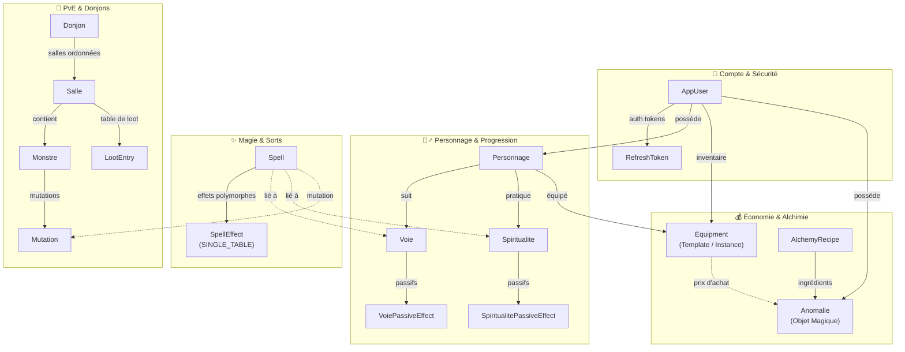
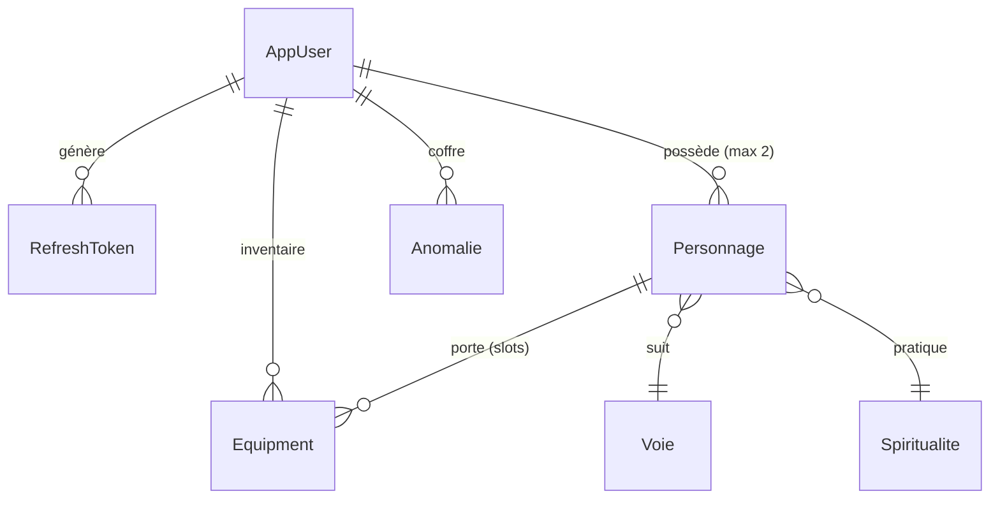
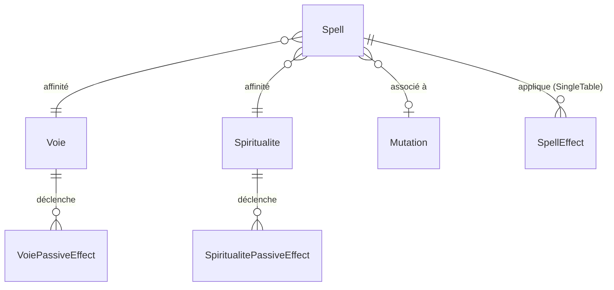
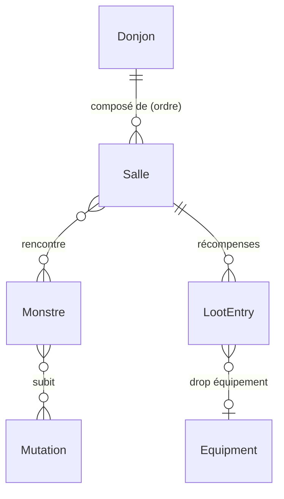
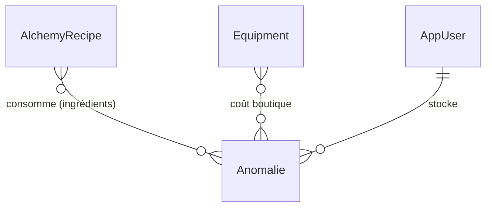

# 🏰 Grimoire — Architecture Java

## Vue d'ensemble

**Grimoire** est un jeu de rôle/RPG web monolithique construit sur **Spring Boot 3.4.4** / **Java 21**, avec un frontend statique (HTML/CSS/JS vanilla) servi directement par le backend. Le backend gère l'intégralité de la logique métier : authentification, gestion des personnages, système de combat PvE en temps réel, crafting, boutique, et un éditeur de sorts complet.

> [!NOTE]
> Package racine : `generation.grimoire` — groupId Maven `generation`, artifactId `grimoire`.

---

## Stack technique

| Composant | Technologie | Version |
|---|---|---|
| Runtime | Java | 21 |
| Framework | Spring Boot | 3.4.4 |
| ORM | Hibernate / JPA | (via spring-boot-starter-data-jpa) |
| BDD | MySQL | 8.0 |
| Sécurité | Spring Security + JWT (jjwt 0.11.5) | — |
| Sérialisation | Jackson + jackson-datatype-hibernate6 | — |
| Boilerplate | Lombok | — |
| Build | Maven (wrapper) | — |
| Conteneurisation | Docker + docker-compose | — |

### Choix architecturaux notables

- **Monolithe pur** — pas de microservices, tout dans un seul JAR.
- **Frontend statique** servi par Spring via `/static/` — pas de moteur de template (Thymeleaf, etc.).
- **Sessions de combat in-memory** (`ConcurrentHashMap`) — pas de persistance des combats en BDD.
- **`ddl-auto=update`** — le schéma BDD évolue automatiquement avec les entités. Pas de migrations (Flyway/Liquibase).
- **Caching activé** (`@EnableCaching`) — utilisé sur les recettes d'alchimie.
- **Scheduling activé** (`@EnableScheduling`) — timeout automatique des combats inactifs.

---

## Structure des packages

```
generation.grimoire/
├── GrimoireApplication.java          ← Point d'entrée (@EnableScheduling, @EnableCaching)
├── TestRunner.java                   ← CommandLineRunner (profil "dev" uniquement)
│
├── config/                           ← Configuration Spring
│   ├── WebMvcConfig.java             ← Enregistrement du CombatInterceptor
│   ├── CombatInterceptor.java        ← Bloque les actions hors-combat si le joueur est en combat
│   └── JacksonConfig.java            ← Module Hibernate6 pour gérer les lazy proxies
│
├── security/                         ← Authentification & autorisation
│   ├── SecurityConfig.java           ← Chaîne de filtres, RBAC (USER/ADMIN), stateless
│   ├── JwtService.java               ← Génération/validation JWT (HS256, 15min)
│   ├── JwtAuthenticationFilter.java  ← Filtre HTTP extrayant le JWT du header
│   ├── RefreshTokenService.java      ← Gestion des refresh tokens persistés en BDD
│   └── UserDetailsServiceImpl.java   ← Bridge vers Spring Security
│
├── controller/                       ← REST API
│   ├── auth/
│   │   └── AuthController.java       ← Login, register, refresh token
│   ├── pve/
│   │   ├── CombatController.java     ← Actions de combat (cast, flee, next-room, SSE)
│   │   ├── DungeonController.java    ← Liste/détail des donjons
│   │   ├── MultiCombatController.java← Lobbies multi-joueurs (créer, rejoindre, SSE)
│   │   └── PvEAdminController.java   ← CRUD admin donjons/monstres/mutations
│   ├── PersonnageController.java     ← CRUD personnages, équipement, spiritualité
│   ├── EquipmentController.java      ← Templates, boutique, inventaire
│   ├── ShopController.java           ← Boutique (achat/vente, prix anomalies)
│   ├── WebSpellCreationController.java ← Éditeur de sorts (CRUD complet avec effets)
│   ├── AlchemyController.java        ← Recettes et crafting
│   ├── AnomalieController.java       ← CRUD anomalies (objets magiques)
│   ├── EnumMetaController.java       ← Exposition des métadonnées d'enums au frontend
│   └── DebugController.java          ← Endpoint de debug (dev)
│
├── service/                          ← Logique métier
│   ├── pve/
│   │   ├── CombatService.java        ← Service de façade pour le combat
│   │   ├── CombatRoomService.java    ← Gestion des salles, loots et progression
│   │   ├── CombatTurnService.java    ← Moteur de tours, initiative et statuts
│   │   ├── CombatActionService.java  ← Résolution des actions de combat (fuite, etc)
│   │   ├── MultiCombatService.java   ← Lobbies multi-joueur + synchronisation
│   │   ├── CombatEventEmitter.java   ← SSE (Server-Sent Events) pour le temps réel
│   │   └── PvEAdminService.java      ← Opérations CRUD admin PvE
│   ├── SpellService.java             ← Résolution et lancement des sorts (641 lignes)
│   ├── PassiveDispatcher.java        ← Dispatch des événements aux passifs (mediator)
│   ├── AlchemyService.java           ← Crafting avec vérification d'ingrédients
│   ├── DataInitializerService.java   ← Seed des Voies et Spiritualités au démarrage
│   ├── RenameCascadeService.java     ← Cascade de renommage (anomalies → recettes, etc.)
│   ├── PersonnageService.java        ← Accès simple aux personnages
│   └── VoieService.java              ← Accès simple aux voies
│
├── entity/                           ← Entités JPA (modèle de données persisté)
│   ├── auth/
│   │   ├── AppUser.java              ← Utilisateur (rôle, monnaie, unlocks)
│   │   └── RefreshToken.java         ← Token de rafraîchissement
│   ├── personnage/
│   │   ├── Personnage.java           ← Entité centrale du jeu
│   │   ├── PersonnageCombatHelper.java ← Logique de combat et stats extraite
│   │   └── ActiveShield.java         ← Bouclier actif en combat
│   ├── pve/
│   │   ├── Donjon.java               ← Donjon (salles ordonnées)
│   │   ├── Salle.java                ← Salle (combat, trésor, piège, événement, boss...)
│   │   ├── Monstre.java              ← Template de monstre (stats, type, behavior)
│   │   ├── Mutation.java             ← Mutation applicable aux monstres
│   │   └── LootEntry.java            ← Table de loot (probabilité + récompense)
│   ├── spell/type/effect/            ← 21 sous-types de SpellEffect (voir section dédiée)
│   ├── voie/passif/                  ← Passifs de Voie (8 implémentations spécifiques)
│   ├── spiritualite/passif/          ← Passifs de Spiritualité (3 implémentations)
│   ├── Spell.java                    ← Sort (coûts, type de cast, effets)
│   ├── SpellEffect.java              ← Classe abstraite racine des effets (SINGLE_TABLE)
│   ├── Equipment.java                ← Équipement / consommable (template ou instance)
│   ├── Anomalie.java                 ← Objet magique (monnaie alternative)
│   ├── AlchemyRecipe.java            ← Recette d'alchimie
│   ├── Voie.java                     ← Voie (classe de personnage)
│   └── Spiritualite.java             ← Spiritualité (sous-classe thématique)
│
├── model/pve/                        ← Objets transients (non persistés en BDD)
│   ├── CombatSession.java            ← État complet d'un combat en cours
│   ├── MultiCombatSession.java       ← État d'un lobby multi-joueur
│   ├── ActiveMonster.java            ← Instance vivante d'un monstre en combat
│   ├── InitiativeEntry.java          ← Entrée dans l'ordre d'initiative
│   └── SpellAvailability.java        ← Disponibilité d'un sort (grisage frontend)
│
├── dto/                              ← Data Transfer Objects (Sécurisation des entrées/sorties)
│   ├── alchemy/
│   ├── equipment/
│   ├── personnage/
│   ├── pve/                          ← LobbyInfoDTO, DonjonDTO, etc.
│   └── spell/
│
├── mapper/                           ← Mappers (MapStruct) pour la conversion Entité ↔ DTO
│   ├── PersonnageMapper.java
│   ├── EquipmentMapper.java
│   └── ...
│
├── enumeration/                      ← 21 enums de domaine
│   ├── StatType, DamageType, EffectTarget, Source
│   ├── SpellCategory, SpellCastingType, SpellCondition
│   ├── EquipmentSlot, EquipmentRarity, EquipmentEffectType
│   ├── MonsterType, MonsterBehavior, RoomType, EventSubType
│   ├── AnomalieCategory, ConsumableCategory, SpiritualiteType
│   ├── VoieType, KarmaAlignment, DetachedSoulRequirement, RecipeRewardType
│
├── event/                            ← Événements de gameplay (pattern Observer)
│   ├── GameEvent.java                ← Interface/classe de base
│   ├── TurnStartEvent.java
│   ├── SpellCastEvent.java
│   ├── SpellCostAdjustEvent.java
│   ├── SpellCostPaidEvent.java
│   ├── CanCastCheckEvent.java
│   └── CastingTypeAdjustEvent.java
│
├── passif/
│   └── PassiveEffect.java            ← Interface unifiée pour tous les passifs
│
├── exception/
│   └── GlobalExceptionHandler.java   ← @ControllerAdvice, JSON structuré
│
├── scheduler/
│   └── CombatTimeoutScheduler.java   ← Auto-flee des combats inactifs (10min)
│
├── repository/                       ← Spring Data JPA repositories
│   ├── auth/ (UserRepository, RefreshTokenRepository)
│   ├── pve/ (DonjonRepository, SalleRepository, MonstreRepository, MutationRepository, LootEntryRepository)
│   ├── PersonnageRepository, SpellRepository, EquipmentRepository
│   ├── AnomalieRepository, SpiritualiteRepository, VoieRepository, AlchemyRecipeRepository
│
└── utils/
    └── StatCalculator.java           ← Résolution des sources de stats (switch exhaustif)
```

---

## Modèle de données (relations clés)

### 1. Cartographie globale par domaines



---

### 2. Schémas relationnels ciblés (par sous-système)

#### A. Joueur, Personnage & Équipement


#### B. Sorts, Voies & Passifs


#### C. Donjons, Monstres & Loots


#### D. Alchimie & Commerce


---

## Choix architecturaux détaillés

### 1. Système de sorts — Héritage SINGLE_TABLE

Le système de sorts utilise le pattern **Single Table Inheritance** de JPA :

- [`SpellEffect`](file:///c:/Users/doson/IdeaProjects/grimoire/src/main/java/generation/grimoire/entity/SpellEffect.java) est la classe abstraite racine avec un `@DiscriminatorColumn("effect_type")`.
- **21 sous-types concrets** implémentent chacun leur propre méthode `apply(caster, target)` :

| Catégorie | Effets |
|---|---|
| **Dégâts** | `DamageEffect`, `DamageFixedEffect`, `DamagePercentageEffect`, `DamageOverTimeEffect` |
| **Soin** | `HealEffect`, `HealFixedEffect`, `HealPercentageEffect`, `HealOverTimeEffect` |
| **Mana** | `ManaEffect`, `ManaFixedEffect`, `ManaPercentageEffect`, `ManaOverTimeEffect` |
| **Chaleur** | `HeatFixedEffect`, `HeatPercentageEffect`, `HeatOverTimeEffect` |
| **Buff/Debuff** | `BuffDebuffEffect`, `ConsumableSpellBuffDebuffEffect` |
| **Utilitaires** | `ShieldEffect`, `DispelEffect`, `PurgeEffect`, `BudEffect` |

**Pourquoi SINGLE_TABLE ?** Performance (pas de JOIN pour charger les effets d'un sort), simplicité des requêtes polymorphiques, et la table reste lisible car les sous-types partagent beaucoup de colonnes.

### 2. Système de passifs — Event-Driven avec Mediator

Architecture basée sur le pattern **Observer/Mediator** :

```
GameEvent → PassiveDispatcher → [PassiveEffect₁, PassiveEffect₂, ...]
```

- [`PassiveEffect`](file:///c:/Users/doson/IdeaProjects/grimoire/src/main/java/generation/grimoire/passif/PassiveEffect.java) — interface unifiée (toutes sources : Voie, Spiritualité, future Race...)
- [`PassiveDispatcher`](file:///c:/Users/doson/IdeaProjects/grimoire/src/main/java/generation/grimoire/service/PassiveDispatcher.java) — collecte dynamiquement les passifs du personnage, les trie par priorité, et dispatch les événements.
- **7 types d'événements** : `TurnStartEvent`, `SpellCastEvent`, `SpellCostAdjustEvent`, `SpellCostPaidEvent`, `CanCastCheckEvent`, `CastingTypeAdjustEvent`.
- **8 passifs de Voie** (un par Voie : Raison, Sûreté, Trahison, Consolidation, Conviction, Création, Destruction, Violence).
- **3 passifs de Spiritualité** (Esprit, Karma, Ténèbre).

**Pourquoi ?** Découplage total entre le moteur de combat et les effets passifs. Ajouter une nouvelle Voie = créer une classe, aucune modification du CombatService.

### 3. Combat — Sessions in-memory + SSE

- Les combats sont stockés dans une `ConcurrentHashMap<String, CombatSession>` dans [`CombatService`](file:///c:/Users/doson/IdeaProjects/grimoire/src/main/java/generation/grimoire/service/pve/CombatService.java).
- Le temps réel utilise **Server-Sent Events (SSE)** via [`CombatEventEmitter`](file:///c:/Users/doson/IdeaProjects/grimoire/src/main/java/generation/grimoire/service/pve/CombatEventEmitter.java) — chaque client reçoit les mises à jour de la session via un `SseEmitter`.
- Un [`CombatTimeoutScheduler`](file:///c:/Users/doson/IdeaProjects/grimoire/src/main/java/generation/grimoire/scheduler/CombatTimeoutScheduler.java) vérifie toutes les 60s et force la fuite des combats inactifs depuis plus de 10 minutes.
- [`CombatInterceptor`](file:///c:/Users/doson/IdeaProjects/grimoire/src/main/java/generation/grimoire/config/CombatInterceptor.java) — HandlerInterceptor qui bloque toute action non-combat pour un joueur en plein combat (redirection vers `/combat.html` pour les pages, 403 pour les API).

**Pourquoi in-memory ?** Les combats sont éphémères et intensifs en I/O (chaque action modifie l'état). La persistence en BDD serait un goulot. Le trade-off est la perte des combats si le serveur redémarre.

### 4. Multi-joueur — Lobby + délégation

- [`MultiCombatService`](file:///c:/Users/doson/IdeaProjects/grimoire/src/main/java/generation/grimoire/service/pve/MultiCombatService.java) gère un système de **lobbies** (code court 6 caractères).
- L'hôte crée un lobby → le guest rejoint avec un code → une fois prêts, le lobby démarre un `CombatSession` partagé.
- Le multi délègue entièrement le combat au `CombatService` existant. Pas de fork du code de combat.

### 5. Sécurité — JWT Stateless + RBAC

- Authentification **JWT HS256** avec access token (15 min) + refresh token (persisté en BDD).
- **2 rôles** : `USER` et `ADMIN`.
- Les GET sur `/api/**` sont **publics** (consultation sans auth).
- Les mutations (POST/PUT/DELETE) sur les entités de jeu nécessitent `ADMIN`.
- Les actions joueur (cast, equip, craft) nécessitent juste une authentification.
- CSRF désactivé (API stateless), sessions désactivées.

### 6. Sérialisation — Hibernate6Module

[`JacksonConfig`](file:///c:/Users/doson/IdeaProjects/grimoire/src/main/java/generation/grimoire/config/JacksonConfig.java) enregistre le `Hibernate6Module` pour que les lazy proxies non-initialisés se sérialisent en `null` au lieu de crasher avec `LazyInitializationException`.

### 7. Initialisation des données — Seed au démarrage

[`DataInitializerService`](file:///c:/Users/doson/IdeaProjects/grimoire/src/main/java/generation/grimoire/service/DataInitializerService.java) utilise `@EventListener(ApplicationReadyEvent.class)` pour créer/mettre à jour les 8 Voies et 3 Spiritualités au démarrage. Chaque entité a ses descriptions, rangs, et passifs associés.

### 8. Pattern Template/Instance pour les Equipment et Anomalies

Les `Equipment` et `Anomalie` utilisent un flag `isTemplate` :
- **Template** = définition de référence, créé par l'admin.
- **Instance** = copie possédée par un joueur, créée via `copyStatsFrom(template)`.

La boutique vend des templates. À l'achat, une instance est créée et associée au joueur.

### 9. Cascade de renommage

[`RenameCascadeService`](file:///c:/Users/doson/IdeaProjects/grimoire/src/main/java/generation/grimoire/service/RenameCascadeService.java) propage les renommages d'anomalies à travers toutes les tables qui les référencent par nom (recettes d'alchimie, prix d'équipements, loot tables...). Nécessaire car certaines relations utilisent des noms (String) plutôt que des FK.

---

## Points d'attention

> [!IMPORTANT]
> ### Risques & Points de vigilance
> - **Combats in-memory** : perte totale en cas de restart du serveur (pas de persistance ni de recovery des sessions en cours).
> - **`ddl-auto=update`** : pratique en dev mais dangereux en production (pas de migration versionnée type Flyway/Liquibase).
> - **Couverture de tests existante** : suite présente (intégration, combat, JWT...), mais le build Docker ignore les tests (-DskipTests). Vigilance : S'assurer d'exécuter les tests manuellement avant chaque push ou de configurer une CI externe pour éviter de déployer des régressions.
> - **Batch fetch** configuré globalement (`default_batch_fetch_size=16`) — optimise le problème N+1 mais requiert une surveillance des requêtes générées.
> - **Références par nom** (anomalies dans les prix/recettes) au lieu de clés étrangères (FK) — repose sur le `RenameCascadeService` pour garantir l'intégrité référentielle.

---

## Déploiement

```
┌──────────────────┐      ┌──────────────────┐
│  Docker (app)    │──────│  MySQL 8.0       │
│  Java 21 JRE     │      │  (docker-compose)│
│  Spring Boot JAR │      │  Port 3306       │
│  Port 8080       │      └──────────────────┘
└──────────────────┘
```

- **Build** : `mvn clean package -DskipTests` dans un conteneur Maven.
- **Run** : `java -jar app.jar` dans un conteneur JRE 21.
- **BDD** : MySQL 8.0 via docker-compose avec volume persistant.
